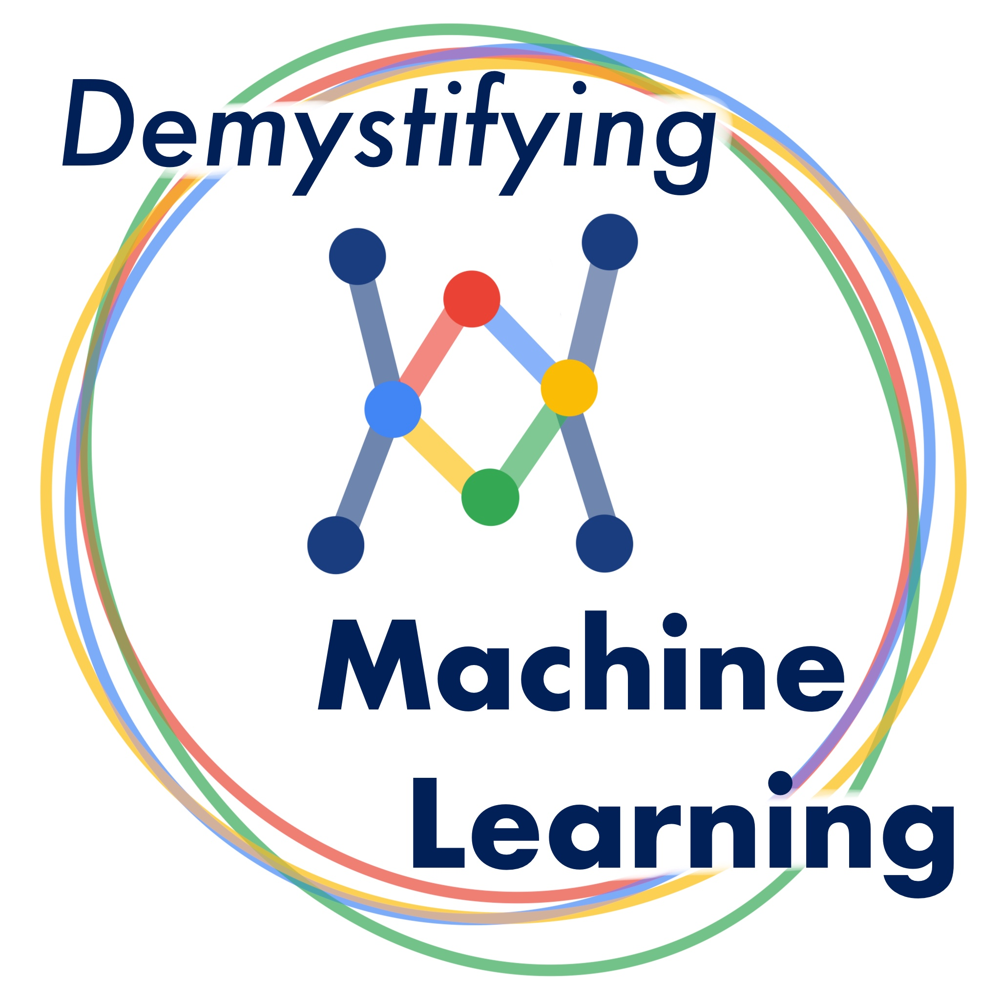

# About

This is the page for all collected resources in DSC at W&M's Fall 2021 workshop series, **"Demystifying Machine Learning"**. Check out our [main site](https://gdsc.community.dev/william-mary/), which contains more information about the group. If you like our workshops, click the "Join Us" button at the top of our site to recieve emails about upcoming events and cool opportunities!

# Workshops

## Workshop 1: [Models and Applications](https://gdsc.community.dev/events/details/developer-student-clubs-william-mary-presents-demystifying-machine-learning-models-and-applications/)
### Date: October 28, 2021
### Educators: Emilio Luz-Ricca
"Machine learning" and "artificial intelligence" are two of the buzz-iest buzzwords of our time. But what does it really mean for a machine to "learn"? In this workshop, we will break down these concepts into more approachable components. Attendees will learn how to frame a machine learning problem in terms of inputs and outputs, seeing how machine learning tasks boil down to well-defined optimization problems. During the interactive coding portion of the workshop, we will focus in on a few intuitive algorithms and think about how the general problem of connecting inputs to outputs is solved by these particular models.

[Click here](models_and_applications/models_and_applications.pptx) to download the slides used in the lesson!

You can follow along on Kaggle with either the [attendee version](https://www.kaggle.com/clareheinbaugh/ml-models-and-applications-student) (not filled in) or the [instructor copy](https://www.kaggle.com/clareheinbaugh/ml-models-and-applications-instructor) (completely filled in).

--------

## Workshop 2: [Computer Vision](https://gdsc.community.dev/events/details/developer-student-clubs-william-mary-presents-demystifying-machine-learning-computer-vision/)
### Date: November 18, 2021
### Educators: Paul Scemama & Emilio Luz-Ricca
Computer vision, the study of machine learning with images and videos as inputs, is one of the most active subtasks in the field of artificial intelligence. In this workshop, we will inspect popular approaches within computer vision, many of which rely on neural networks. During the interactive coding portion, we will work to gain an intuition for image classification and attack an applied computer vision problem.

--------

## Workshop 3: [Ethical Artificial Intelligence](https://gdsc.community.dev/events/details/developer-student-clubs-william-mary-presents-demystifying-machine-learning-ethical-artificial-intelligence/)
### Date: December 2, 2021
### Educators: Alex Cooper & Maxwell Fonss
While artificial intelligence approaches and applications are often very effective, they are not without their own drawbacks. Central to the field of ethical artificial intelligence are questions of privacy, bias, and discrimination. Attendees at this workshop will learn how deployed AI algorithms can fail when they are misunderstood or inappropriately applied. In particular, we will see how unrepresentative datasets can lead to algorithms that display high error rates for the least represented components of the data. Then, we will work to improve these models and discuss how we can work towards a general solution for more ethical AI approaches.

# Cheat sheets

- [Choosing the right model based on data constraints](https://scikit-learn.org/stable/_static/ml_map.png) (source: the `sklearn` library)

# General Resources

- **Python:**
  -  [`scikit-learn`](https://scikit-learn.org/stable/): for general machine learning methods and convenience methods for metrics, preprocessing data, model selection, and more!
  -  [`Tensorflow`](https://www.tensorflow.org/?version=nightly): a lower-level interface for neural networks and deep learning
  -  [`Keras`](https://keras.io/): a simple python interface for designing, training, and evaluating neural networks
  -  [`PyTorch`](https://pytorch.org/): a more involved framework for working with neural networks--particulrly suitable for research
- **R**:
  - [`Tidymodels`](https://www.tidymodels.org/): one of the premier packages for machine learning in R--notably, this integrates very with other "tidy" packages such as those from the [Tidyverse](https://www.tidyverse.org/)
- **Learning about machine learning:**
  -  [_Deep Learning_](https://www.deeplearningbook.org/) (FREE textbook): a very thorough exploration of deep learning and neural networks, all the way from basics to cutting edge research
  -  [_Reinforcement Learning: An Introduction_](https://web.stanford.edu/class/psych209/Readings/SuttonBartoIPRLBook2ndEd.pdf) (FREE textbook): a preprint textbook (mostly complete) that includes a full development on reinforcement learning--the basics to the cutting edge
  -  [_Mathematics for Machine Learning_](https://mml-book.github.io/book/mml-book.pdf) (FREE textbook): all of the math concepts that you need to know to be prepared to engage with the more theoretical aspects of machine learning
  -  [Machine Learning Mastery](https://machinelearningmastery.com/): a site with very approachable machine learning tutorials, including code in popular machine learning and deep learning frameworks (`sklearn`, `keras`, etc.)
